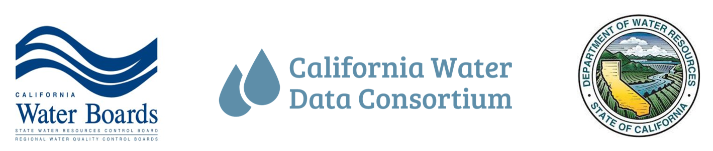
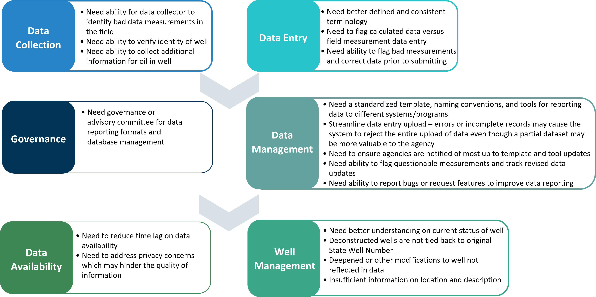

## Project Vision
An accessible open-source water accounting platform that integrates consistent, high-quality data from a variety of sources and effectively communicates this information to support local, regional, and state water management decisions.

## How did we get here?
The California Water Data Consortium, in partnership with Environmental Defense Fund, the Department of Water Resources (DWR), and the State Water Resources Control Board (SWRCB) are developing functional groundwater data reporting formats to reduce local agency reporting burdens and challenges, inform regulatory decisions by consolidating existing reporting datasets, increase data quality and consistency, and support local agency compliance with Sustainable Groundwater Management Act (SGMA) regulations in the State of California (State).

Individuals representing a range of local agencies and reporting programs have been engaged to share experiences and recommendations because it is essential to us that any proposed data reporting formats are useful to the local agencies for their State data reporting requirements. During our engagement with you, we have held numerous meetings including three key working group meetings (June 2022, September 2022, March 2023) where we have collected valuable feedback on:
* Lessons learned from analogous programs,
* Current data collection and reporting practices,
* Challenges faced in data collection and reporting,
* Additional data types that should be considered, and
* Programs that should be assessed in developing crosswalks and standards.

In addition to working group meetings, we have received input through focused meetings with local agencies and organizations outside California. Based on input received, the project team has performed a detailed review of reporting formats, databases, and documentation across State programs, including:
* Sustainable Groundwater Management Act (SGMA) Program
* California Statewide Groundwater Elevation Monitoring (CASGEM) Program
* SWRCB GeoTracker Data Management System
* Safe and Affordable Funding for Equity and Resilience (SAFER) Program
* US Geological Survey (USGS) National Water Information System (NWIS)

## Why is data reporting standardization important?
The Open and Transparent Water Data Act (AB 1755, Dodd) is aimed at water data consistency, transparency, accessibility, discoverability, and usability to leverage the value of data in California water management decision-making and to improve public trust. Among the statutory requirements for implementation of AB 1755 is the development of protocols for data sharing, documentation, quality control, public access, and promotion of open-source platforms and decision support tools related to water data.

The diagram below highlights some of the challenges and needs associated with making groundwater data throughout California more open and transparent. Challenges often arise from the point of data collection to management statewide well databases through time The development of the proposed data formats, documentation, and crosswalk tools aim to improve workflows and streamline data management in a way that reduces the burden of data management. 

